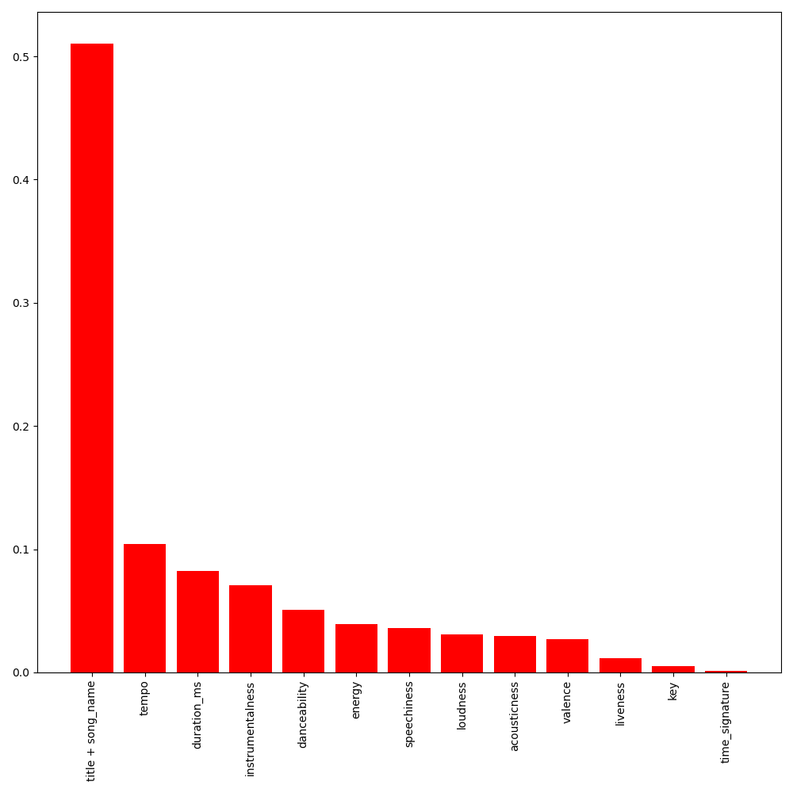
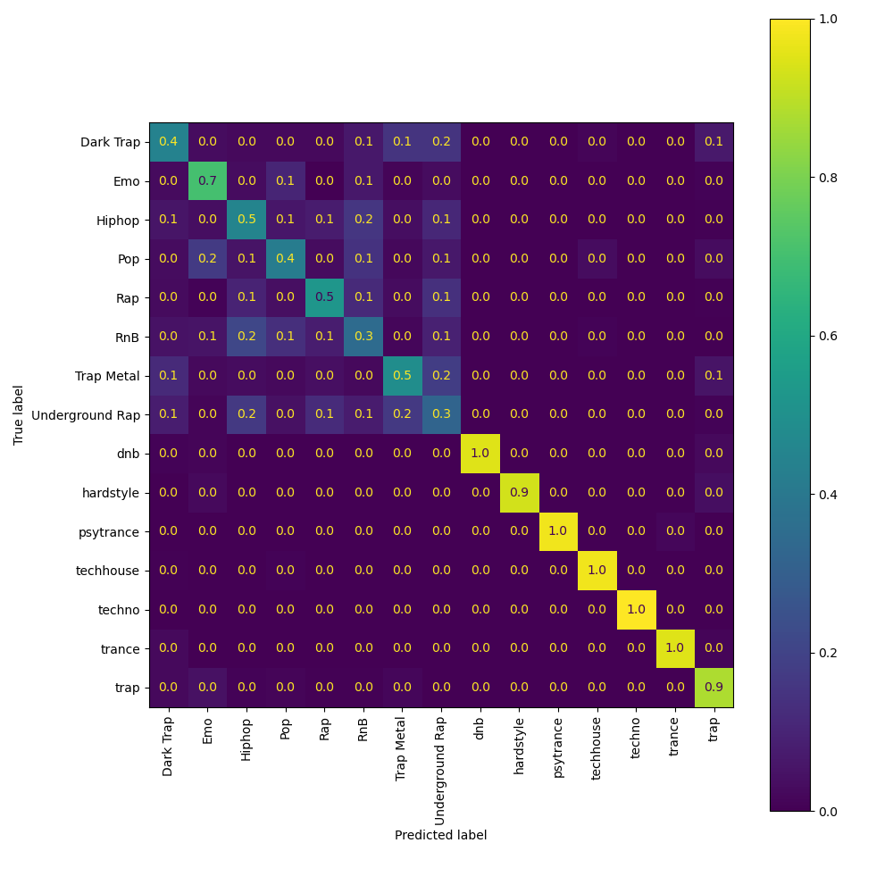

# Genre classification
Exercise 14 of the Udacity class on Machine Learning workflows. The objective of this exercise is to bring the lesson's contents together in a complete ML pipeline that produces a trained Random Forest model.

## Dataset
The dataset used in this exercise is a modified version of the original songs dataset: [here](https://www.kaggle.com/mrmorj/dataset-of-songs-in-spotify)

## Model
We use a Random Forest to perform songs' genre classification (NLP).

## Results

The model was evaluating using a test set from the dataset, with an AUC (Area Under the Curve) of 0.95326. The following figures show the feature importances and the confusion matrix computed during the evaluation step: 

 <!-- Images -->

  
  

